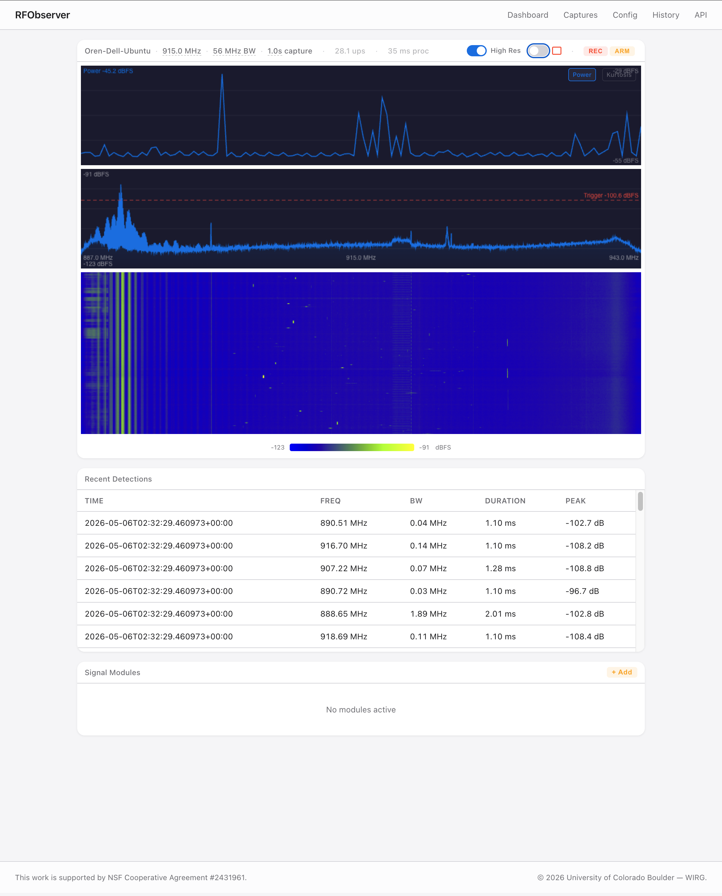

# RFObserver

RFObserver (or RFObs) is a python application to monitor, visualize and process RF spectrum using SDRs with a live Web UI. It is been developed for continuous RFI detection, monitoring and enforcement at the Hat Creek Radio Observatory using [OpenZMS](https://openzms.net/). The instantaneous bandwidth is configurable and depends on the SDR and compute available. The current version deployed and being tested uses the B205mini SDR and the Jetson Nano Super for compute.



RFObserver supports configurable add-ons to the post processing pipeline for demodulation. Currently, FM demoulation is supported. It has following features:

- Continuous full-duty-cycle IQ capture from USRP SDRs (B200/B205mini tested), with frequency sweep support.
- Real-time PSD grid + summary PSD computation, IQ statistics (mean/max/median/std/kurtosis).
- Rolling burst detector with dual-threshold hysteresis on per-bin noise floor.
- Trigger-based IQ recording (manual or power-threshold) with a pre-trigger circular buffer; streaming-to-disk or RAM-buffered modes.
- Capture view with waterfall and spectrogram in the Web UI for post analysis
- Pluggable post-processing add-ons; FM audio demodulation included.
- Configurable via API
- Local WebUI (FastAPI + HTMX): live spectrogram, detection history, capture browser, runtime reconfiguration of every pipeline knob.
- Local SQLite store of detections + capture metadata; long-running with WAL.
- Outbound integrations: OpenZMS DST (SigMF observations) and NATS JetStream (`rfobs.stats.<hostname>` per-window envelopes).
- Mock receiver for development without hardware; integration tests cover the most of the pipeline against synthetic IQ.

## Quick Start

```bash
# Install
pip install .

# Show config
rfobserver config

# Run with mock receiver (no hardware)
RFOBS_MOCK_RECEIVER=true rfobserver run

# Run web UI only
rfobserver web
```

## Development

```bash
# Install hatch
pip install hatch

# Run unit tests
hatch run test:unit

# Run integration tests (requires NATS)
docker compose -f docker/docker-compose.yml up -d nats
hatch run test:integration

# Lint
ruff check src/rfobserver/
ruff format --check src/rfobserver/
mypy src/rfobserver/
```

## License

BSD 3-Clause. See [LICENSE](LICENSE).

## Acknowledgement

This work is supported by NSF Cooperative Agreement #2431961.

## Copyright

&copy; 2026 University of Colorado Boulder &mdash; Wireless Interdisciplinary Research Group (WIRG).
