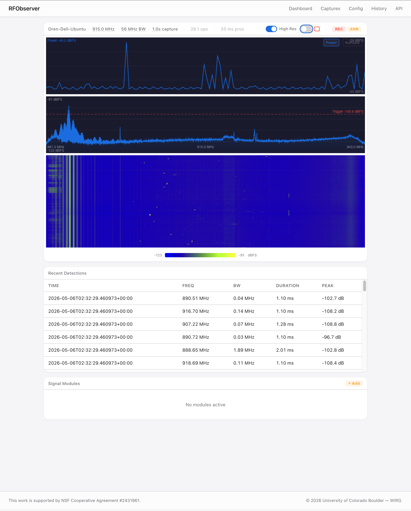

# RFObserver

RFObserver (or RFObs) is a python application to monitor, visualize and process RF (Radio Frequency) spectrum using SDRs with a live Web UI. It is been developed for continuous RFI detection, monitoring and enforcement at the Hat Creek Radio Observatory using [OpenZMS](https://openzms.net/). Radio Observatories are very sensitive to local RF transmissions since they overpower weak RF signals that are inherently emitted due to physical processes by bodies in space such as the Sun. This makes observatories require stringent control over RF transmission. RFObserver in tandem with OpenZMS opens up a  possibility to use the RF spectrum dynamically when the observatory is not observing or observing only in a certain spectrum. 

The instantaneous bandwidth for RFObs is configurable and depends on the SDR and compute available. The current version deployed and being tested uses the B205mini SDR and the Jetson Nano Super for compute.



RFObserver supports configurable add-ons to the post processing pipeline for demodulation. Currently, FM demoulation is supported. It has following features:

- Continuous full-duty-cycle IQ capture from USRP SDRs (B200/B205mini tested), with frequency sweep support.
- Real-time PSD grid + summary PSD computation, IQ statistics (mean/max/median/std/kurtosis).
- Rolling burst detector with dual-threshold hysteresis on per-bin noise floor.
- Trigger-based IQ recording (manual or power-threshold) with a pre-trigger circular buffer; streaming-to-disk or RAM-buffered modes.
- Capture view with waterfall and spectrogram in the Web UI for post analysis; captures download as raw files or SigMF, resumable over HTTP
- Pluggable post-processing add-ons; FM audio demodulation included.
- Configurable via API
- Local WebUI (FastAPI + HTMX): live spectrogram, detection history, capture browser, runtime reconfiguration of every pipeline knob.
- Local SQLite store of detections + capture metadata; long-running with WAL.
- Outbound integrations: OpenZMS DST (SigMF observations) and NATS JetStream (`rfobs.stats.<hostname>` per-window envelopes).
- Mock receiver for development without hardware; integration tests cover the most of the pipeline against synthetic IQ.

## Quick Start

```bash
# Install
pip install .

# Show config
rfobserver config

# Run with mock receiver (no hardware)
RFOBS_MOCK_RECEIVER=true rfobserver run

# Run web UI only
rfobserver web
```

> **`rfobserver: command not found`?** A user install (`pip install .` without a
> virtualenv or `sudo`) places the `rfobserver` script in `~/.local/bin`, which
> is often not on `PATH` — pip prints a `WARNING: The script rfobserver is
> installed in '.../.local/bin' which is not on PATH` when this happens. Add it
> to your `PATH` and reload the shell:
>
> ```bash
> echo 'export PATH="$HOME/.local/bin:$PATH"' >> ~/.bashrc
> source ~/.bashrc
> ```
>
> Or invoke it without touching `PATH`, via the full path
> (`~/.local/bin/rfobserver config`) or as a module (`python3 -m rfobserver config`).

## Downloading captures

Each capture on the Captures page has a Download section. The same files are
plain HTTP downloads, so they can be scripted:

```bash
SENSOR=http://sensor:8888

# What is available: every capture's files with sizes, plus its SigMF names
curl -s $SENSOR/captures/list | python3 -m json.tool

# One file (-C - resumes an interrupted download; the server supports HTTP Range)
curl -C - -O -J $SENSOR/captures/download/<capture>.sc16

# The same IQ as standard SigMF, for inspectrum, GNU Radio, the sigmf library, etc.
curl -C - -O -J $SENSOR/captures/download/<capture>.sigmf-meta
curl -C - -O -J $SENSOR/captures/download/<capture>.sigmf-data

# Everything on the sensor, resumable (re-run after an interruption)
curl -s $SENSOR/captures/list |
  python3 -c 'import sys,json; [print(f["name"]) for c in json.load(sys.stdin) for f in c["files"]]' |
  while read -r f; do curl -s -C - -o "$f" "$SENSOR/captures/download/$f"; done
```

Files available per capture: `.sc16` (raw interleaved int16 I/Q), `.json`
(capture metadata), `.psd` and `.psd.json` (the waterfall grid), and
`.detections.json`. `.sigmf-data` is the `.sc16` itself, which is byte-identical
to SigMF `ci16_le`; `.sigmf-meta` is generated from the `.json`, with each
overflow gap marked as a new capture segment so timestamps stay correct. A
capture that is still being recorded answers `409` until it is finalized.

The web UI has no authentication: anyone who can reach the port can download
captures.

## Development

```bash
# Install hatch
pip install hatch

# Run unit tests
hatch run test:unit

# Run integration tests (requires NATS)
docker compose -f docker/docker-compose.yml up -d nats
hatch run test:integration

# Lint
ruff check src/rfobserver/
ruff format --check src/rfobserver/
mypy src/rfobserver/
```

## License

BSD 3-Clause. See [LICENSE](LICENSE).

## Acknowledgement

This work is supported by NSF Cooperative Agreement #2431961.

## Copyright

&copy; 2026 University of Colorado Boulder &mdash; Wireless Interdisciplinary Research Group (WIRG).
