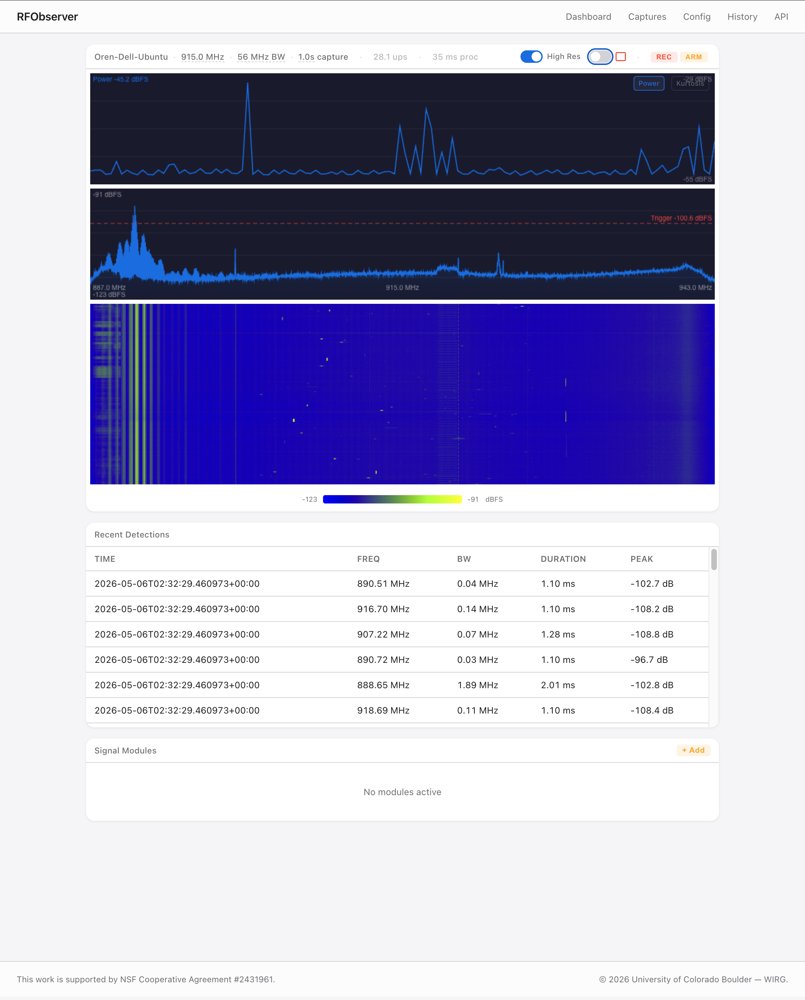

# RFObserver

RFObserver (or RFObs) is a python application to monitor, visualize and process RF (Radio Frequency) spectrum using SDRs with a live Web UI. It is been developed for continuous RFI detection, monitoring and enforcement at the Hat Creek Radio Observatory using [OpenZMS](https://openzms.net/). Radio Observatories are very sensitive to local RF transmissions since they overpower weak RF signals that are inherently emitted due to physical processes by bodies in space such as the Sun. This makes observatories require stringent control over RF transmission. RFObserver in tandem with OpenZMS opens up a  possibility to use the RF spectrum dynamically when the observatory is not observing or observing only in a certain spectrum. 

The instantaneous bandwidth for RFObs is configurable and depends on the SDR and compute available. The current version deployed and being tested uses the B205mini SDR and the Jetson Nano Super for compute.



RFObserver supports configurable add-ons to the post processing pipeline for demodulation. Currently, FM demoulation is supported. It has following features:

- Continuous full-duty-cycle IQ capture from USRP SDRs (B200/B205mini tested), with frequency sweep support.
- Real-time PSD grid + summary PSD computation, IQ statistics (mean/max/median/std/kurtosis).
- Rolling burst detector with dual-threshold hysteresis on per-bin noise floor.
- Trigger-based IQ recording (manual or power-threshold) with a pre-trigger circular buffer; streaming-to-disk or RAM-buffered modes.
- Capture view with waterfall and spectrogram in the Web UI for post analysis; captures download as raw files or SigMF, resumable over HTTP
- Pluggable post-processing add-ons; FM audio demodulation included.
- Configurable via API
- Local WebUI (FastAPI + HTMX): live spectrogram, detection history, capture browser, runtime reconfiguration of every pipeline knob.
- Local SQLite store of detections + capture metadata; long-running with WAL.
- Outbound integrations: OpenZMS DST (SigMF observations) and NATS JetStream (`rfobs.stats.<hostname>` per-window envelopes).
- Mock receiver for development without hardware; integration tests cover the most of the pipeline against synthetic IQ.

## Quick Start

```bash
# Install
pip install .

# Show config
rfobserver config

# Run with mock receiver (no hardware)
RFOBS_MOCK_RECEIVER=true rfobserver run

# Run web UI only
rfobserver web
```

> **`rfobserver: command not found`?** A user install (`pip install .` without a
> virtualenv or `sudo`) places the `rfobserver` script in `~/.local/bin`, which
> is often not on `PATH` — pip prints a `WARNING: The script rfobserver is
> installed in '.../.local/bin' which is not on PATH` when this happens. Add it
> to your `PATH` and reload the shell:
>
> ```bash
> echo 'export PATH="$HOME/.local/bin:$PATH"' >> ~/.bashrc
> source ~/.bashrc
> ```
>
> Or invoke it without touching `PATH`, via the full path
> (`~/.local/bin/rfobserver config`) or as a module (`python3 -m rfobserver config`).

## Downloading captures

Each capture on the Captures page has a Download section. The same files are
plain HTTP downloads, so they can be scripted:

```bash
SENSOR=http://sensor:8888

# What is available: every capture's files with sizes, plus its SigMF names
curl -s $SENSOR/captures/list | python3 -m json.tool

# One file (-C - resumes an interrupted download; the server supports HTTP Range)
curl -C - -O -J $SENSOR/captures/download/<capture>.sc16

# The same IQ as standard SigMF, for inspectrum, GNU Radio, the sigmf library, etc.
curl -C - -O -J $SENSOR/captures/download/<capture>.sigmf-meta
curl -C - -O -J $SENSOR/captures/download/<capture>.sigmf-data

# Everything on the sensor, resumable (re-run after an interruption)
curl -s $SENSOR/captures/list |
  python3 -c 'import sys,json; [print(f["name"]) for c in json.load(sys.stdin) for f in c["files"]]' |
  while read -r f; do curl -s -C - -o "$f" "$SENSOR/captures/download/$f"; done
```

Files available per capture: `.sc16` (raw interleaved int16 I/Q), `.json`
(capture metadata), `.psd` and `.psd.json` (the waterfall grid), and
`.detections.json`. `.sigmf-data` is the `.sc16` itself, which is byte-identical
to SigMF `ci16_le`; `.sigmf-meta` is generated from the `.json`, with each
overflow gap marked as a new capture segment so timestamps stay correct. A
capture that is still being recorded answers `409` until it is finalized.

The web UI has no authentication: anyone who can reach the port can download
captures.

## Storage

RFObserver defends a free-space floor on the volume that holds `STORAGE_PATH`
(and, separately, on the volume that holds `DB_PATH` if that is a different
device), whatever else is filling it. The floor is `RFOBS_DISK_MIN_FREE_GB`; the
default `0` means auto: 5% of the volume, at least 2 GB (46 GB on a 916 GB SSD).
`RFOBS_ARCHIVE_MAX_GB` still caps automatic captures on its own. Every
`RFOBS_STORAGE_CHECK_SEC` (10 s) the sensor samples free space and moves along
this ladder:

| Step | When | What RFObserver does |
|---|---|---|
| 0 | free >= floor | nothing |
| 1 | free < floor, automatic captures or burst files exist | deletes the oldest isolated bursts, then the oldest `auto/` captures, until free >= floor x 1.15 |
| 2 | free < floor, no automatic capture left | prunes PSD history to 7 days and detections to 90 days |
| 3 | still below the floor on the next check | refuses to start recordings, automatic and manual |
| 4 | free < floor / 2 | stops storing PSD blobs; the per-window stats rows are still written |

Steps are cumulative, and leaving one takes three checks in a row at floor x 1.15
or more, so a sensor sitting at the floor does not flap. A recording in progress
also checks free space about once a second and ends itself early
(`stopped_reason: "disk_floor"` in its `.json`) when free drops below half the
floor, before the disk is actually full.

Manual captures (`manual/`) and the capture being recorded are never deleted.
From step 2 on, nothing the sensor does raises free space: someone has to
download and delete manual captures or remove whatever else filled the volume.

With continuous triggering, step 1 can settle into deleting each new automatic
capture shortly after it is saved. When a storage check evicts a capture less
than 10 minutes old, the sensor flags `evicting_young` in health (and logs a
warning naming the capture and its age) for 30 minutes after the last such
eviction, without changing `step` or `status` -- steps 1-2 stay "working as
designed".

The database file does not shrink. Pruning PSD blobs and deleting old rows free
pages inside the file, which later inserts reuse, so the file stops growing
instead of getting smaller (`db_reusable_gb` shows how much is free inside it).
Stats rows, detections and minute rollups are kept for
`RFOBS_STATS_RETENTION_DAYS` (730); PSD blobs for `RFOBS_DB_RETENTION_DAYS`.

`GET /api/health` reports all of this in its `storage` block:

```bash
curl -s $SENSOR/api/health | python3 -m json.tool
```

```json
"storage": {
  "free_gb": 42.1, "floor_gb": 45.8, "volume_gb": 916.0,
  "db_gb": 44.0, "db_reusable_gb": 3.2,
  "auto_gb": 480.3, "manual_gb": 118.7, "bursts_gb": 1.2,
  "step": 1, "step_text": "evicting the oldest automatic captures",
  "step_since": "2026-09-23T10:00:00+00:00",
  "last_write_error": null,
  "degraded_since": null,
  "db_volume": null
}
```

`db_volume` is `{free_gb, floor_gb}` when `DB_PATH` is on another device. The
health `status` is `degraded` at step 3 or above, and also while the sticky
warning is set: any write failure (for example a full disk, recorded in
`last_write_error` and in the capture's `.json` as `write_failed` /
`write_error`) or reaching step 3 sets `degraded_since`. The warning survives a
restart and stays after space recovers, so it is seen; the Dashboard shows it
as a banner. Once you have dealt with the cause, clear it from the banner or
with:

```bash
curl -X POST $SENSOR/api/storage/clear-degraded
```

## Burst isolation and attribution

Two switches on the Configuration page (Burst Isolation card), both off by
default:

- **Isolation** (`RFOBS_ISOLATION_ENABLED`): each strong burst the detector
  reports is cut out of the wideband IQ (its peak shifted to DC and
  decimated), saved as a SigMF pair and offered to add-on modules. A burst must
  be `RFOBS_ISOLATION_SNR_DB` (13) over the noise floor at its peak, at most
  `RFOBS_ISOLATION_MAX_PER_SEC` (20) are taken per second, strongest first, and
  only the first `RFOBS_ISOLATION_MAX_BURST_SEC` (0.5) of a longer burst is kept.
- **Attribution** (`RFOBS_ATTRIBUTION_ENABLED`): isolated bursts are decoded
  with rtl_433 and the `model`, `protocol_id` and `attribution` are written
  onto the detection. The live waterfall labels decoded bursts with the model.
  Turning attribution on turns isolation on.

Attribution needs rtl_433 built from master (the SilverSpring-Mesh decoder is
protocol 383, not in a release yet). The sensor looks for
`RFOBS_ATTRIBUTION_RTL433_PATH`, then `$RTL433`, then
`~/rtl_433_build/build/src/rtl_433`, then `rtl_433` on `PATH`. If none is
found, attribution stays off with a warning and isolation still runs.

To install it, run `sudo ./deploy/install_rtl433.sh` from the repo root
(`deploy/install.sh` runs it too; set `RFOBS_SKIP_RTL433=1` to skip). It builds
a pinned, tested master commit with file input only (no SDR drivers, about
20 s on a Jetson) and installs `/usr/local/bin/rtl_433`, which the systemd
service finds on its `PATH`. Restart RFObserver afterwards. Set `RTL433_REF`
to build another commit, `PREFIX` for another install location, and `FORCE=1`
to rebuild over an existing install.

Files go under `STORAGE_PATH/bursts/`:

- live: `bursts/YYYYMMDD/<burst_id>.sigmf-data` and `.sigmf-meta`, linked to
  the detection by burst_id;
- replay: `bursts/replay-<capture name>/`, with the rtl_433 results in
  `attribution.jsonl` there. A replay never writes the database.

`bursts/` is capped at `RFOBS_BURST_ARCHIVE_MAX_GB` (2), oldest first, and
counts as `bursts_gb` in the health `storage` block. Below the storage floor,
burst files are deleted before automatic captures. Bursts alone hold the ladder
at step 1 only when deleting them would reach the floor; otherwise it moves on
to step 2 and 3 as usual, and from step 3 no new burst files are saved (modules
and attribution still get the bursts).

Isolation reads each burst from the IQ ring after detection finishes, so the
ring grows to `RFOBS_ISOLATION_LOOKBACK_SEC` (2.0 s) when that is longer than
the pre-trigger. That costs about 104 MB of RAM per second of lookback at
26 Msps and 224 MB at 56 Msps. If the ring plus the working set for one
`RFOBS_ISOLATION_MAX_BURST_SEC` burst would take more than a quarter of the
available RAM, isolation is disabled with an error, and health says why.
Paced UI replay at speed > 1 shortens the effective isolation lookback by that
factor (2.0 s at 4x holds 0.5 s of real time); offline replay is lossless and
holds the receiver back until isolation has read each burst.

The two switches take effect the next time the pipeline starts (toggle Sensor
Active off and on). A lookback change resizes the ring at once, like a
pre-trigger change; the SNR, per-second and burst-length limits also apply at
once. `GET /api/health` has an `isolation` block with the
state, the rtl_433 path and counters for every outcome (isolated, expired, too
long, queue full, errors, decoded, not decoded, dropped).

## Development

```bash
# Install hatch
pip install hatch

# Run unit tests
hatch run test:unit

# Run integration tests (requires NATS)
docker compose -f docker/docker-compose.yml up -d nats
hatch run test:integration

# Lint
ruff check src/rfobserver/
ruff format --check src/rfobserver/
mypy src/rfobserver/
```

## License

BSD 3-Clause. See [LICENSE](LICENSE).

## Acknowledgement

This work is supported by NSF Cooperative Agreement #2431961.

## Copyright

&copy; 2026 University of Colorado Boulder &mdash; Wireless Interdisciplinary Research Group (WIRG).
